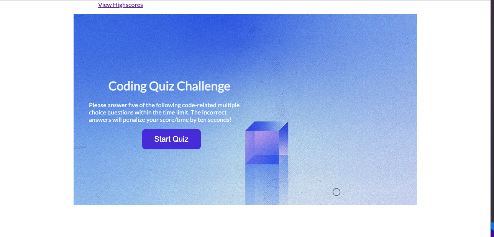
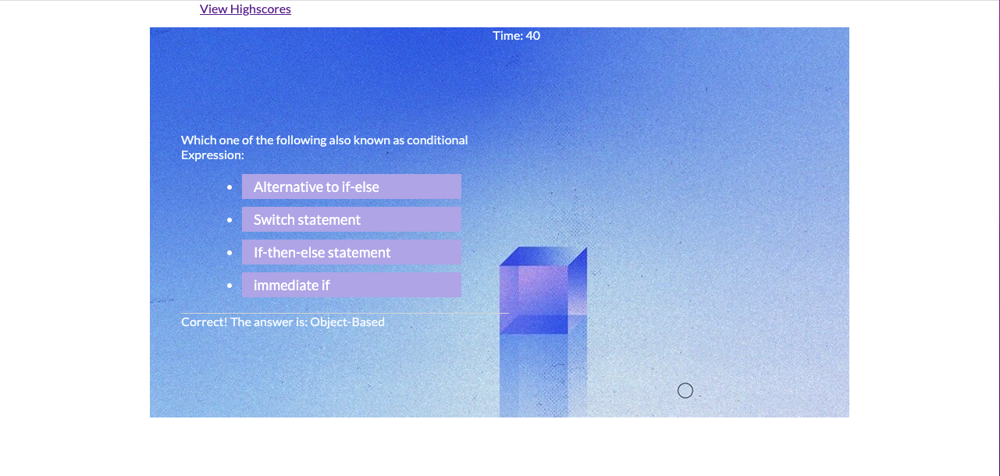
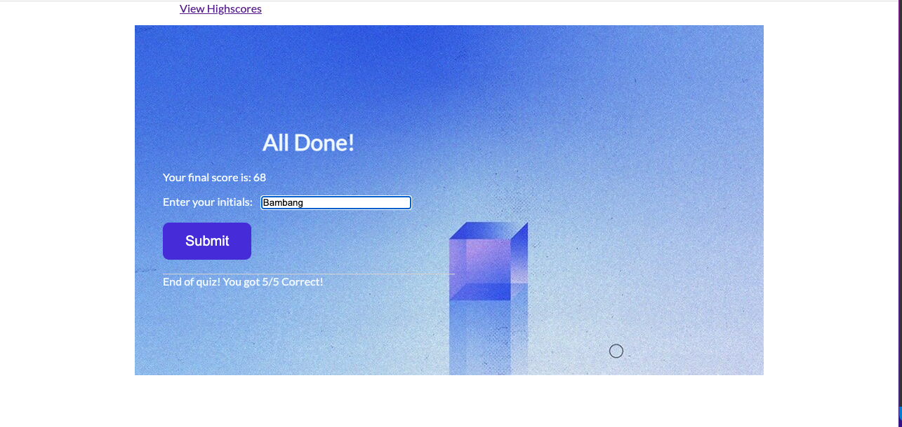
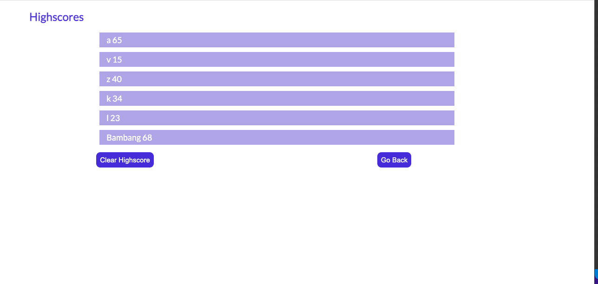

# codequiz

## Description
You can test your JavaScript skills with this multiple-choice questions Code-Quiz. In this format, users will be given one question for which they will have three or four options to choose from. Based on the user choice, the score will be incremented. Upon selection of an option, the next question appears automatically. In addition to this, a submit button is introduced, the functionality of which is exactly what their name suggests. after submitting you can go back and start again with the same or the different person. For HTML, I have index.html and HighScores.html, for JavaScript, I have script.js and HighScores.js, for CSS I have styles.css and reset.css. All the questions and answers I put in script.js, for all initials and score, I put in the local storage in HighScores.Js. I use Lato-Google Fonts, a sans serif typeface family by Warsaw-based designer Lukasz Dziedzic, in Polish 'Lato' means 'Summer'. In CSS, I use display: flex; flex-direction: row; and flex wrap: wrap to resize from the bigger screen to the smaller screen. I use a media query to change the color of the screen when resize to max-width: 640 px; and the background color change from white to color: rgb(223, 209, 231).

## Demo

## Link to Website
https://b-smd.github.io/codequiz/

https://github.com/B-smd/codequiz.got

## Technologies Used
- JavaScript
- HTML
- CSS

## Usage
There is five multiple-choice questions you need to answer. When you click the start button, the timer will starts and you are presented with a question. When you answer a question then you are presented with another question. But if you answer a question incorrectly, then time is subtracted 10 seconds from the clock. When the timer reaches 0 or all questions are answered, then the game is over. When the game is over, then you can save your initials and your score. Then click the goback button and you or another person can start quiz again.

## Contributing
Pull request are welcome, you can make a constribution at the bottom of any docs page to make small changes such as a typo, sentence fix or a broken link. For major changes, please open an issue first to discuss what you would like to change.

## Licence
[MIT]
(http)://choosealicence.com/licences/mit/)
